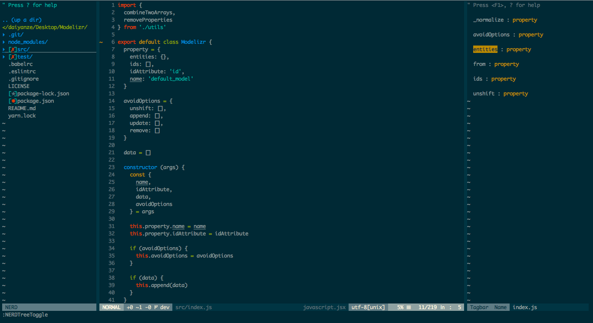

# Vimmy
A beginner-friendly vim configuration.



### Intro
Vimmy is nothing new but a simple vim configuration under my own taste.
It has a very easy-to-understand structure. So if you want any customization,
simple add scripts in `.vimrc` file.

For loading global configurations, put them in `.configs/before.vim`.

For loading plugins, directly put them in `.vimrc`.

For loading other configurations, put them in `.configs/after.vim`.

##### Vimmy Work Flow:
```
1. Vim starts
2. load .vimrc
3. import before.vim script
4. start loading plugins
5. import plugins.vim script
6. import after.vim script
```  

### MacOS & Linux
##### Install
Step one: install ctags for [tagbar](https://github.com/majutsushi/tagbar)
```
# MacOS
brew install ctags

# Linux (Debian)
sudo apt-get install exuberant-ctags

# Linux (Fedora)
sudo yum install ctags
```
Step two: Install Vimmy
```
git clone https://github.com/daiyanze/Vimmy ~/.vimmy && bash ~/.vimmy/install.sh
```

##### UnInstall
```
bash ~/.vimmy/uninstall.sh
```

### Windows
Please consider to use editors like Sublime/Atom/VScode.
I think they work better than Vim on Windows.
##### Install
1. Install the default plugins from `./configs/plugins.vim`. with [vim-plug](https://github.com/junegunn/vim-plug)
2. Combine `./configs/before.vim` `.vimrc` `./configs/plugins.vim` `./configs/after.vim` into one file `_vimrc`
3. Replace `_vimrc`.
4. Install plugins with [vim-plug](https://github.com/junegunn/vim-plug) by vim command `:PlugInstall`

### FAQ
Ask me anything about this configuration. I'm not an expert but we can share experience together.
Thanks.

### License
MIT
